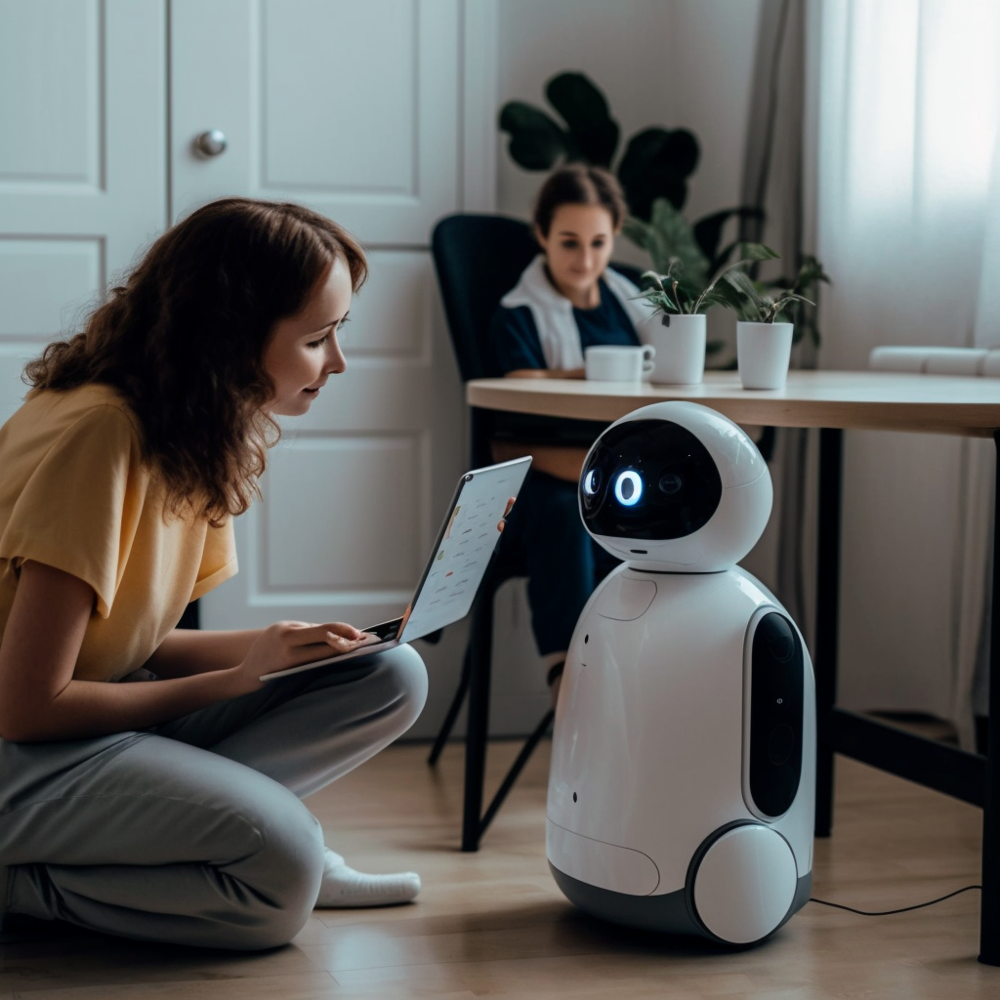

# ChatGPT Voice Assistant

## 🚀 Project Overview 

This project is a simple voice assistant that can answer questions and perform basic tasks, such as searching the web or playing music.
The voice assistant uses the OpenAI API to generate responses to user queries, and the Amazon Polly API to generate speech output.

## Installation 🧰
To install the dependencies for this project, run the following command:

    pip install -r requirements.txt

You will also need to set up environment variables for your OpenAI and Amazon Polly API keys.
See the API Keys section below for more information.

## Usage 🧑🏾‍💻
To run the voice assistant, simply run the following command:

    python main.py

You can then speak to the voice assistant and ask it questions or give it commands. Some examples of things you can ask include:

"Who is Elon Musk?"
"What's the difference between machine learning and artificial intelligence?"
"What's the capital of France?"
The voice assistant will respond to your queries with spoken output.

## API Keys 🔐
This project requires API keys for both the OpenAI API and the Amazon Polly API. To set up these API keys, you will need to create environment variables for them. Here's how to do it:

Open a terminal window.

Set the following environment variables:

    OPENAI_API_KEY=<your OpenAI API key>
    AMAZON_POLLY_API_KEY=<your Amazon Polly API key>

Note: Replace <your_openai_secret_key>, <your_aws_access_key_id>, and <your_aws_secret_access_key> with your actual API keys.

Save these environment variables by adding the above commands to a .env file in the root directory of this project.

## ⚠️ Limitations and Future Work

One of the limitations known so far is the speed at which the app takes to recognise speech, send a request to the ChatGPT API, and convert the returned text into speech.
Perhaps this is due to the fact that the app is running on a local machine (a 2017 Macbook Pro with intel core i5), and not a server. Some ideas to improve this further include:
- Using a server to run the app, and using a cloud service to host the ChatGPT API.
- Using a different speech recognition and text-to-speech library, such as OpenAI's Whisper API, which is a cloud-based API that can be used to generate speech output.

Furthermore, I plan to add error handling to the app, so that it can handle errors such as the ChatGPT API returning an error, or the user not speaking into the microphone. To ensure that this app is reliable, secure, and of high quality, I plan to add unit tests to the app.
Nevertheless, I hope this gives anyone a good starting point to create customised voice assistants.

Special thanks to the creators of the OpenAI and Amazon Polly APIs for providing the tools that made this project possible.

## License
This project is licensed under the MIT License. See the LICENSE file for more details.

## Contact
If you have any questions or issues with this project, please contact Ibrahim at ibrahim.aka.ajax@gmail.com.